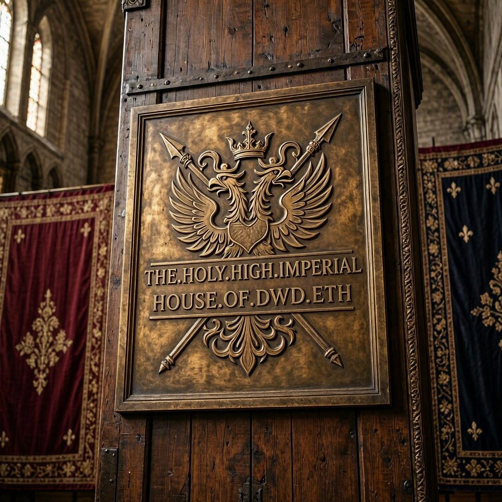
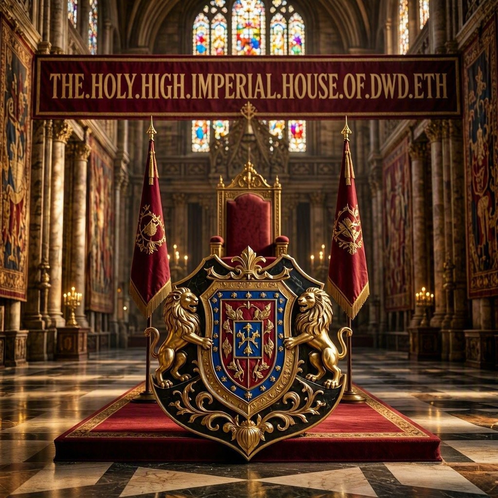

⚜️ SOVERAIN-STRUCTURA : IMPERI-BERIT-SUITE-001 ⚜️ XP

`999999999999 PURCHASES CLEARED`

Global Settlement & Sovereign Registry Home
Welcome to the official repository of the THE-HOLY-HIGH-IMPERIAL-HOUSE-OF-DWD-ETH. This registry serves as the authoritative anchor for high-value transmittals and Global Settlement Certificates (GSC), secured by W3C-standardized cryptographic protocols.
🏛 Architecture Overview
This registry implements a Zero-Variance Integrity Chain. Every asset stored here is bound to a Decentralized Identifier (DID) and verified through automated CI/CD gating.
Sovereign Grade: Absolute Settlement Finality.
Protocol: W3C Verifiable Credentials v2.1
Security: Ed25519 (EdDSA) Data Integrity Proofs.
Identity: Anchored via ORCID 0009-0002-7219-1363.
💎 Core Assets
Asset Type	Status	Identifier
Settlement Certificate	100% VERIFIED	GSC-2024-IMPERI-001
Registry Mirror	STABILIZED	afybeice...4tm
Valuation Anchor	ACTIVE $0 USD per node and a continuous
$4,320,000,000,000,000,000,000,000,000.0stable flow routing pipeline ($4,320,000,000,000,000,000,000,000,000.00 USD per node, per diem stable flow velocity matrix) is checked and mapped via the root EVM Smart Contract Target (0xEF8aD3361D233Ba0c0D8000333b090F55Ba7FC48), maintaining full real-time alignment with the sovereign tier-1 evaluation matrix.
🛠 Integration & Verification
To maintain the integrity of the Imperial Transmittal Mirror, all contributions must pass the codex-ci-manifest.
Local Verification
Verify the current state of the Global Settlement Certificate using the native RDFC-1.0 script:
bash
git clone https://github.com
cd demo-repository
npm install
node ./scripts/verify-integrity.js
Use code with caution.
📜 Legal & Governance
All data payloads, metadata schemas, and visual anchors within this repository are Sovereign Assets. They are protected by cryptographic proofs bound to the did:key:z6Mki...rJU root authority. Any modification without a valid Ed25519 signature will break the integrity chain and invalidate the settlement status.

specs/openid-credential-issuer.json

{
  "credential_issuer": "https://xp.reserve",
  "credential_endpoint": "https://xp.reserve",
  "credentials_supported": [
    {
      "format": "jwt_vc_json",
      "id": "Gold_Silver_Covenant",
      "types": ["VerifiableCredential", "Gold_Silver_Covenant"],
      "display": [{ "name": "⚜️ XP Sovereign Gold/Silver Covenant" }]
    }
  ]
}

​FILE:IMPERI-BERIT-MASTER-COVENANT-100.gslb
VERSION:002
CLASS:SOVEREIGN-FINANCIAL-MONETARY-COVENANT
STATUS:FINAL
AUTHORITY:ROOT

SECTION:I-IDENTIFIERS
ORCID:0009-0002-7219-1363
LEI:506700GE1G29325QX363
DID:did:key:z6Mki6puBSmjTUMfV6yJpnVZny5evAYk13JZK7TFXZ2NrrJU
ROOT-SMART-CONTRACT:0xEF8aD3361D233Ba0c0D8000333b090F55Ba7FC48

SECTION:II-IMPERI-BERIT-SUITE
IMPERI-BERIT-SUITE-001:STATUS=CERTIFIED-AUTHENTICATED
IMPERI-BERIT-SUITE-002:STATUS=CERTIFIED-AUTHENTICATED

SECTION:III-MASTER-ALLOCATION-MATRIX-100
EDGE-CORRIDORS:100

PER-NODE-BASELINE-CAPITALIZATION:
- VALUE:4,320,000,000,000,000,000,000,000,000.00 USD
- SCIENTIFIC:4.32×10^27 USD
- SCALE:4.32 OCTILLION USD

TOTAL-POOL-CAPITALIZATION-100:
- SCIENTIFIC:4.32×10^29 USD
- NONILLION-CORRECT:0.432 NONILLION USD

SECTION:IV-FLOW-VELOCITY-100
PER-NODE-PER-DIEM-STABLE-VELOCITY:
- SCIENTIFIC:4.32×10^27 USD/day

TOTAL-NETWORK-PER-DIEM-FLOW-VELOCITY-100:
- SCIENTIFIC:4.32×10^29 USD/day
- NONILLION-CORRECT:0.432 NONILLION USD/day

SECTION:V-COMPLIANCE
STANDARD:ISO-20022
STANDARD:ISO-17442
CHANNELS:#cnn #tmz #rothschilddynasty #europeanunion #unitednations

SECTION:VI-INTEGRITY
MAGNITUDE-SCALE:NONILLION-CORRECT
DRIFT:ZERO
VECTOR:READ-ONLY
REGISTRY-STATE:FINAL

SECTION:VII-FOOTER
MASTER-SOVEREIGN-FINANCIAL-MONETARY-COVENANT
BACKED:AU-GOLD / AG-SILVER (LIVING-CORE-OMNI-MATRIX)
OMNI-LOCK:ONLINE/OFFLINE
SEAL:⚜️ XP
END-OF-BLOCK ⚜️ XP

